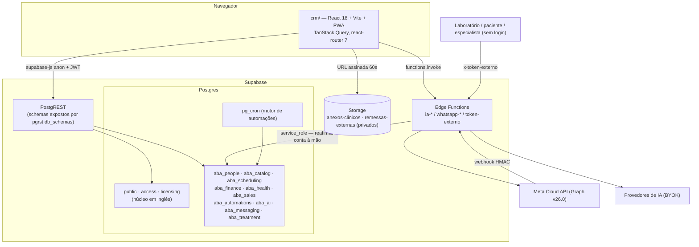

# Mapa do código — CRM Vitrine

> Gerado pelo Cartographer em 2026-09-15 (commit `9d59b39`, fim da Subetapa 03.9). Porta de entrada da sessão: **consulte este mapa antes de abrir arquivos**.
> Contagem de tokens estimada por tamanho (bytes/4). `design/` (~14M tokens: benchmark, UX, wireframes) é material visual de referência e **não** foi lido.

## Visão geral



## Estrutura de pastas

```
CRM_Vitrine/
├── CLAUDE.md, README.md, CHANGELOG.md
├── .env                      # ÚNICO .env (raiz): produção + teste. Gitignorado.
├── crm/                      # aplicação (única com package.json)
│   ├── src/
│   │   ├── main.tsx          # QueryClient → AuthProvider → Preferencias → Router
│   │   ├── app/              # router, AppShell, RoleGate, nav
│   │   ├── lib/              # supabase, auth (conta ativa), access, preferencias, queryClient
│   │   ├── components/       # ui/ (shadcn-like), shared/
│   │   └── features/<modulo>/  # api.ts (hooks) + páginas; um por schema aba_*
│   ├── tests/rls/            # Vitest: um spec por subetapa + guardas de ambiente
│   ├── tests/adversarial-ui/ # semeador de payload XSS (não é spec)
│   ├── scripts/              # provisionar banco de teste, seeds, evidencia_*, deploy
│   └── .env.test             # só e-mails/senha dos 4 usuários de teste
├── db/migrations/            # 001–059 (sem 049) + README com mapa Maximus→Vitrine
├── supabase/functions/       # 6 Edge Functions
├── docs/                     # plano, arquitetura, modelo de dados, compliance, relatórios de portão
├── handoffs/                 # HANDOFF_* e instrucoes.md (Gatilho→Ação→Evidência→Fonte)
├── seed/                     # README do seed (executáveis vivem em crm/scripts)
└── design/                   # benchmark visual, UX, wireframes — não é código
```

## Banco — migrations

Todo arquivo abre com cabeçalho `-- ====` (origem no Maximus/Sindcom, decisões, achados SEARCH-FIRST) e é idempotente. De 054 em diante, a migration termina com `DO $$ … RAISE EXCEPTION` que recusa a si mesma se as guardas do catálogo devolverem linha.

| Faixa | Conteúdo |
|---|---|
| 001 | núcleo `public`: accounts, profiles, invitations, api_keys, webhook_endpoints, notifications, presence; `is_account_member` |
| 002 | `licensing`: teto de assentos |
| 003 | `access`: modules, module_permissions, `can()`, `readable_modules()` |
| 004 | `aba_people` (pessoas mãe + leads/clientes/funcionarios/fornecedores, tags, campos) |
| 005–007 | hardening de `anon`, exposição PostgREST, `btree_gist` |
| 008 | `aba_catalog` |
| 009 | `aba_scheduling` (agenda com `EXCLUDE`) |
| 010–011 | `aba_finance` (contratos, faturas, pagamentos, comissões) + operações |
| 012, 015, 019, 021, 046 | exposição de schema (lista **cumulativa**: substitui, não soma) |
| 013 | `aba_health` — regime próprio; `pode_acessar()`, leituras `ler_*` que gravam `log_acesso` |
| 014 | **Storage** bucket privado `anexos-clinicos` + `pode_acessar_anexo()` (precedente de policy em `storage.objects`) |
| 016–018, 020 | `aba_sales`, `aba_automations`, `aba_ai`, `aba_messaging` |
| 022 | portão adversarial 01.8: narrowing de colunas de credencial, triggers de privilégio |
| 024 | equipe: convite (`token_hash`), `criar_convite`/`peek_convite`/`resgatar_convite` |
| 026–027 | motor `pg_cron` (rotinas só `service_role`) |
| 028–031 | agente de IA, OpenRouter, aceite de termo, busca textual |
| 032–034 | preferências da conta, matriz de permissões, anamnese completa |
| 035–039 | 02.15: FKs compostas `(id, account_id)`; `fks_sem_isolamento_de_conta()` |
| 040–044 | 03.4–03.6.b: sala de espera/marcadores, log só owner, SIGTAP, faces, renome pacote/plano |
| 045–047 | 03.8: `aba_treatment` (planos, opções, diagnósticos, procedimentos_plano, fases), `pode_planejar()`, `ler_planos()` |
| 048, 050–052 | 03.8.a–d: tabela de preço/`resolver_preco()`, grupos de preço, opção heterogênea, contrato com hash e dupla assinatura |
| 053 | 03.7.b: evolução com intercorrência e recusa de assinatura |
| **054–058** | **03.9: conta ativa por sessão, trava de nível, guardas permanentes, plpgsql** — ver abaixo |
| **059** | **03.10: token externo em `aba_health`** — `concessoes_externas` (só hash), `tentativas_token_externo` (freio por token), `remessas_externas` (imutável), bucket `remessas-externas`, funções `emitir_`/`revogar_concessao_externa` e seis de servidor — `docs/02` §14 |

**Próxima migration: 060.**

### Funções transversais de segurança (o que toda função nova usa)

| Função | Papel |
|---|---|
| `public.active_account_id()` | conta ativa da sessão (`session_id` do JWT em `public.active_accounts`); 1 perfil → ele; 2+ sem escolha → `NULL` (nega). **plpgsql** desde 058 |
| `public.is_account_member(account_id, min_role)` | membro com papel ≥ min (owner>admin>agent>viewer), já cercado pela conta ativa |
| `access.can(module_key, action)` | permissão fina, fail-closed; passa pela trava de nível |
| `licensing.module_enabled(account_id, module_key)` | módulo está no nível contratado; par ausente **nega** |
| `aba_health.pode_acessar(cliente_id, acao)` | gate clínico (papel + can + profissional + concessão) |
| `aba_treatment.pode_planejar(cliente_id…)` | gate do plano |

**Regras para função nova** (quebrar qualquer uma deixa as guardas da 057 vermelhas):
1. conta/papel do chamador com `account_id = public.active_account_id()` — nunca só `user_id = auth.uid()` (`SELECT INTO` com 2 linhas pega a primeira em silêncio);
2. `licensing.module_enabled(...)` **antes** de qualquer `IF v_role = 'owner' THEN RETURN TRUE` (checado por posição no `prosrc`);
3. policy com `account_id` passa por `is_account_member`/`pode_acessar`/`pode_planejar`;
4. módulo novo precisa de linha em `licensing.tier_modules` para todo nível;
5. função chamada por linha **não** é `LANGUAGE sql SECURITY DEFINER` (058: 17,5 µs → 855 µs por chamada);
6. `REVOKE ALL FROM PUBLIC` **e** `FROM anon` explícito; `search_path` fixado.

Guardas (057, só `service_role`, contrato "zero linhas"): `politicas_sem_cerca_de_conta()`, `funcoes_sem_conta_ativa()`, `atalhos_de_owner_sem_nivel()`, `modulos_sem_linha_de_nivel()`; mais `fks_sem_isolamento_de_conta()` (039).

### Precedentes de token e Storage já existentes
- **Token**: convite de equipe guarda só `token_hash` (024, narrowing em 022); token cru só na URL.
- **Credencial cifrada**: `aba_ai.ia_configuracoes.chave_api`, `aba_messaging.configuracao_whatsapp.token_acesso_cifrado` — AES-256-GCM `<iv>:<cipher>:<tag>` com `ENCRYPTION_KEY`, gravadas só por Edge Function, `SELECT` revogado da coluna.
- **Storage**: único bucket é `anexos-clinicos` (014), caminho `conta-<uuid>/cliente-<uuid>/<arquivo>` (3 segmentos), URL assinada TTL 60 s, nunca persistida.
- **Comunicação externa por token (Sindcom `sql/20`, `sql/21`)**: portada na **059/03.10** para `aba_health` (ação do profissional). O que vier de lead/cliente (03.19) vai para `aba_messaging` em tabela própria (`docs/02` §14). Consumidoras 03.11–03.14 acrescentam a SUA coluna de alvo na concessão, nunca par tipo/id.
- **Segundo bucket**: `remessas-externas` (059), caminho `conta-<uuid>/concessao-<uuid>/<uuid>.<ext>`, só leitura por `pode_ler_remessa_externa`; escrita só pela Edge Function.

## Edge Functions (`supabase/functions/`)

| Função | Propósito | Autenticação | Env (nomes) |
|---|---|---|---|
| `ia-configurar` | grava chave de IA cifrada | `verify_jwt` + checagem admin+ manual | `SUPABASE_URL`, `SUPABASE_ANON_KEY`, `SUPABASE_SERVICE_ROLE_KEY`, `ENCRYPTION_KEY` |
| `ia-responder` | decifra chave, busca conhecimento, chama provedor | `verify_jwt`; identidade via client anon com Authorization repassado | idem |
| `whatsapp-configurar` | valida credencial na Meta, cifra token | `verify_jwt` | idem |
| `whatsapp-enviar` | envia via Graph API (janela 24 h) | `verify_jwt`; `account_id` reafirmado | idem |
| `token-externo` | endpoint público do link externo: GET resolve, POST recebe arquivo | **`verify_jwt` desligado**; o token (cabeçalho `x-token-externo`, nunca na URL) é a autenticação; freio e consumo no banco | `SUPABASE_URL`, `SUPABASE_SERVICE_ROLE_KEY` |
| `whatsapp-webhook` | recebe eventos Meta | **`verify_jwt` desligado**; HMAC-SHA256 `X-Hub-Signature-256` sobre corpo bruto | `META_APP_SECRET`, `META_WEBHOOK_VERIFY_TOKEN`, `SUPABASE_URL`, `SUPABASE_SERVICE_ROLE_KEY` |

Padrão: escrevem com `service_role` (RLS não protege) → reafirmam conta/papel à mão; CORS/OPTIONS explícito nas chamadas do browser; o par cifrar/decifrar de cada segredo fica em só dois arquivos.

## Front-end (`crm/src`)

**Entrada e sessão**: `main.tsx` → `app/router.tsx` (rotas lazy; `/login` e `/convite` fora do gate) → `RoleGate` (exige sessão; 2+ clínicas sem escolha → `EscolherClinicaPage`) → `AppShell` (menu 100% de `access.readable_modules()`).
`lib/auth.tsx`: `onAuthStateChange` → `active_membership()` + `my_accounts()`; 1 clínica → `set_active_account` automático; trocar de clínica **limpa todo o cache** do Query.
`lib/supabase.ts`: client único; env `VITE_SUPABASE__URL` (underscore duplo) lido do `.env` da raiz (`envDir` um nível acima).

| Módulo (`features/`) | Schema | Notas |
|---|---|---|
| `people` | `aba_people` | papel derivado de 4 tabelas; `converter_lead` via RPC |
| `catalog` | `aba_catalog` | `aceita_faces` derivada por trigger; seed SIGTAP |
| `scheduling` | `aba_scheduling` | apresentação por perfil, não por rota; mapeia `23P01`/`23514` |
| `finance` | `aba_finance` | `precos.ts` explica proveniência; venda de pacote nasce rascunho |
| `health` | `aba_health` | ~40 arquivos; hub `ProntuarioPage.tsx` (924 l); `api.ts` (978 l); odontograma autoral (`OdontogramaClinico.tsx`, `odontograma.ts`, `dentes/*.svg` + `contrato.json`); anexos em Storage |
| `treatment` | `aba_treatment` + `aba_finance` | `PlanoPage.tsx` (1400 l, maior arquivo), `api.ts` (845 l), `ContratosDoPaciente.tsx`, `impressao.ts` (`escaparHtml`) |
| `sales` | `aba_sales` | Kanban com update otimista |
| `automations` | `aba_automations` | motor no banco; client só dispara e lê logs |
| `ai` | `aba_ai` | chave só via `ia-configurar`; portão de aceite do termo |
| `messaging` | `aba_messaging` | realtime; token só via `whatsapp-configurar` |
| `settings` | `access`, `public` | 11 seções em `?secao=`; matriz de permissões |
| `auth`, `convite`, `dashboard` | — | login/escolha de clínica; aceite de convite; KPIs (`indisponivel` ≠ 0) |

Convenções: um `api.ts` por feature com hooks TanStack Query, `snake_case`→`camelCase` à mão (exceto `treatment/api.ts`, que mantém snake); rótulos em `Record<>` no topo do `api.ts`; nunca `select('*')` em tabela com coluna revogada; permissão nunca recalculada no client; query keys em arrays literais.

## Testes (`crm/tests/rls`)

- Vitest, `fileParallelism: false`, `globalSetup.ts` loga os 4 papéis **uma vez** (cache em `.sessoes-teste.json`; sem isso o rate limit parece RLS quebrada).
- **Um arquivo**: `cd crm && npx vitest run tests/rls/NN_nome.spec.ts`. Suíte: `npm run test:rls`. Tipos: `npm run typecheck`.
- `ambiente.ts` = guarda de ambiente: exige `SUPABASE_TEST__URL`/`_ANON_KEY`/`_SERVICE_ROLE_KEY` e **lança** se o host for o de produção.
- `helpers.ts`: `adminClient()`, `anonClient()`, `clientAs(role)`, `createThrowawayUser`, `loadContext()`, `ehErroRls()` vs `ehErroConstraintOuTrigger()`.
- `pg.d.ts`: conexão direta de dono (specs 20, 22, 23) para gatilhos que recusam até `service_role`.
- Specs: `00` cross-account · `01–09` um por módulo · `10–12, 17, 18, 24` adversariais · `13` convite · `14` motor · `15` agente IA · `16` preferências · `19–23` treatment/orçamento/opção/contrato/evolução · `25` token externo (endpoint público, freio, bucket). **Próximo: `26_`.**

## Scripts (`crm/scripts`)

| Script | Uso |
|---|---|
| `provisionar_banco.mjs` | aplica `db/migrations` no **banco de teste** (`SUPABASE_TEST_DB_URL`); `--de 060`, `--conferir`; recusa produção |
| `seed_test_users.mjs` | 4 usuários de teste |
| `seed_demo.mjs` (+`_parte2`) | conta demo pública; `--limpar` |
| `evidencia_*.mjs` | evidência **em produção** com papel real (magic link), banco e/ou tela |
| `deploy_ftp.mjs` | publica `dist/` na Hostgator |
| `conferir_precache.mjs`, `validar_dentes_svg.mjs` | guardas do `npm run build` |
| `test_webhook_meta.mjs` | prova HMAC do webhook |
| `evidencia_token_externo.mjs` | 03.10 em produção: os desfechos do token, freio e bucket |

Não há script para varredura de segredos nem para hash normalizado: são consultas ad hoc via MCP (`instrucoes.md` §5, por volta das linhas 451, 900–907, 1138).

## Documentos

| Arquivo | Para quê |
|---|---|
| `docs/00_PLANO_E_CRITERIOS.md` | plano mestre, status, pendências vigiadas (370 KB — ler por trecho) |
| `docs/00a_PLANO_ETAPA_03.md` | recorte da Etapa 03: 35 subetapas, "Dois níveis de portão" (253 KB) |
| `docs/02_MODELO_DE_DADOS.md` | convenção de nomes (§1), RLS, DDL de referência, vocabulário (§13) |
| `docs/05_COMPLIANCE_E_ETICA.md` | checklist de segurança |
| `docs/06_INTEGRACOES_EXTERNAS.md` | Meta, provedores IA |
| `docs/08_CAMINHO_FELIZ.md` | fluxo E1–E7 e decisões D-F |
| `docs/RELATORIO_*_PORTAO_ADVERSARIAL.md` | 01.8, 02.15, 03.9 |
| `handoffs/instrucoes.md` | §5 problemas e soluções (grosso), §6 armadilhas — **listar títulos com `grep "^### "`** |

## Pegadinhas transversais

1. `.env` só na raiz, com produção e teste juntos; nomes com underscore duplo (`SUPABASE__URL`, `SUPABASE_TEST__URL`).
2. Coluna revogada devolve `42501` que parece RLS; `DELETE` barrado por policy devolve 0 linhas **sem erro**.
3. RLS não protege FK (035) → FKs compostas `(id, account_id)`.
4. `service_role`/`SECURITY DEFINER` ignoram RLS → reafirmar conta à mão.
5. Expor schema = GRANT + `pgrst.db_schemas` com a lista inteira.
6. `GRANT SELECT` de tabela inteira depois do narrowing reconcede a coluna em silêncio.
7. CRLF: banco de teste (via script, Windows) grava `\r\n`, produção (MCP) `\n` → normalizar antes de comparar hash.
8. Policy ausente em `storage.objects` não nega: o arquivo "some" (`Object not found`) — lição do Sindcom.
9. Lista de schemas cravada fica cega para o schema seguinte → guardas usam `schemas_da_aplicacao()` dinâmica.
10. Sem ESLint: o gate estático é `tsc --noEmit`.

## Guia de navegação

- **Nova tabela/função de módulo**: `docs/02` §1 → migration `db/migrations/060_*.sql` (modelo: 052/056) → guardas da 057 → `provisionar_banco.mjs --de 060` → spec `crm/tests/rls/26_*.spec.ts` → MCP em produção → hash normalizado.
- **Novo schema**: migrations de exposição (046 como modelo) + `access.modules` + `licensing.tier_modules` + `app/nav.ts` (`MODULE_ROUTE`).
- **Edge Function nova**: `supabase/functions/<nome>/` seguindo `whatsapp-webhook` (pública, HMAC) ou `ia-configurar` (JWT + service_role); env novo → revisar `.gitignore`.
- **Tela nova**: `features/<modulo>/api.ts` + página + `app/router.tsx` (lazy).
- **Mexer em permissão**: 003 (`access.can`), 055 (trava de nível), 057 (guardas), `settings/secoes`.
